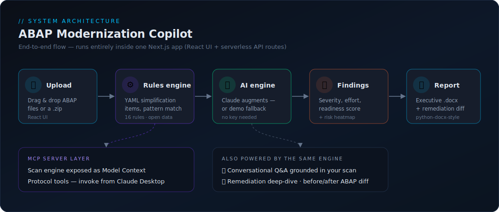

# ABAP Modernization Copilot

> AI-augmented **S/4HANA migration readiness analysis** for custom ABAP code.
> Upload ABAP programs → pattern-match against an open catalog of S/4HANA
> simplification items → score migration readiness → generate AI remediation
> guidance and a board-ready Word report.

[](https://nextjs.org/)
[](https://www.typescriptlang.org/)
[](https://docs.anthropic.com/)
[](LICENSE)

---

## ✨ What it does

| Capability | Description |
|---|---|
| 🔍 **Rules engine** | 16+ S/4HANA simplification-item rules in editable YAML, pattern-matched over raw ABAP (comment-aware, case-insensitive). |
| 🤖 **AI augmentation** | Claude analyzes each program, classifies severity/effort, and writes remediation guidance — *with a deterministic demo engine so the app works with **no API key**.* |
| 📊 **Readiness scoring** | Per-program and portfolio 0–100 readiness scores with a Risk × Effort heatmap. |
| 🔧 **Remediation deep-dive** | Before/after ABAP code diff (ECC → S/4HANA), step-by-step migration instructions, edge cases, and verification steps. |
| 💬 **Conversational Q&A** | Ask follow-up questions grounded in *your* scan results. |
| 📄 **Word report** | One-click executive `.docx` with summary tables, severity breakdown, narrative, and per-program detail. |
| 🗜️ **Portfolio scan** | Drag in up to 50 files or a `.zip` and scan the whole landscape at once. |

## 🧭 Architecture

<p align="center">
  
</p>

```
 ABAP upload ──▶ YAML Rules Engine ──▶ Claude (or demo engine) ──▶ Findings ──▶ Word report
 (drag & drop)   (simplification       (severity, remediation,    (score +       (.docx)
  / .zip)         item matching)        readiness score)           heatmap)
```

Everything runs in a single **Next.js** app — React frontend + serverless API
routes — so it deploys to Vercel in one step (no separate Python backend or
Docker required).

```
src/
├─ app/
│  ├─ page.tsx                # landing + app shell
│  ├─ api/
│  │  ├─ scan/                # POST  → portfolio scan
│  │  ├─ remediate/           # POST  → remediation deep-dive (markdown)
│  │  ├─ chat/                # POST  → conversational Q&A
│  │  ├─ report/              # POST  → executive .docx (or ?preview=1 for narrative)
│  │  ├─ samples/             # GET   → bundled sample ABAP set
│  │  └─ meta/                # GET   → engine mode + rule count
│  └─ globals.css             # dark IBM Plex design system
├─ components/                # Uploader, Dashboard, Heatmap, Findings, Chat, …
├─ lib/
│  ├─ rulesEngine.ts          # YAML loader + ABAP pattern matcher
│  ├─ engine.ts               # orchestrator: Claude ↔ demo fallback
│  ├─ mockEngine.ts           # deterministic demo engine (no LLM)
│  ├─ claude.ts               # Anthropic SDK wrapper
│  ├─ prompts.ts              # prompt library (system/scan/report/remediate/chat)
│  └─ docx.ts                 # Word report generator
└─ rules/
   └─ simplification-items.yaml   # open rule dataset — contributions welcome
samples/                      # synthetic ABAP programs to scan immediately
mcp/                          # MCP server exposing the scan engine as tools
docs/architecture.svg         # architecture diagram
```

## 🚀 Quick start

```bash
npm install
npm run dev
# open http://localhost:3000  →  click "Load sample ABAP set"  →  "Run Scan"
```

The app runs in **DEMO MODE** out of the box (no key needed). To enable live
Claude analysis:

```bash
cp .env.example .env.local
# set ANTHROPIC_API_KEY=sk-ant-...
npm run dev
```

The header pill shows **DEMO MODE** or **LIVE · <model>** accordingly.

## ☁️ Deploy

This repo is Vercel-ready.

1. Push to GitHub.
2. Import the repo at [vercel.com/new](https://vercel.com/new).
3. *(Optional)* add `ANTHROPIC_API_KEY` in **Project → Settings → Environment Variables** for live mode.
4. Deploy. That's it — the demo works even without a key.

Or from the CLI:

```bash
npm i -g vercel
vercel            # preview deploy
vercel --prod     # production deploy
```

## 🔌 MCP server (Claude Desktop)

The scan engine is also exposed as an **MCP server**, so you can scan ABAP and
browse the rule catalog directly from any MCP client (e.g. Claude Desktop) —
no web UI needed.

```bash
cd mcp
npm install
npm run smoke   # spins up the server over stdio and runs a test scan
```

**Tools exposed:**

| Tool | Description |
|---|---|
| `scan_abap` | Scan ABAP `source` → findings (severity, lines, root cause, remediation), 0–100 readiness score, severity breakdown. |
| `list_simplification_rules` | List the rule catalog, optionally filtered by `category` / `severity`. |

**Claude Desktop config** (`claude_desktop_config.json`):

```json
{
  "mcpServers": {
    "abap-copilot": {
      "command": "node",
      "args": ["ABSOLUTE/PATH/TO/abap_copilot/mcp/server.mjs"]
    }
  }
}
```

Then ask Claude Desktop: *"Scan this ABAP program for S/4HANA blockers"* and paste your code.

## 🧩 Extending the rules

Rules live in [`src/rules/simplification-items.yaml`](src/rules/simplification-items.yaml).
Each rule is matched line-by-line against ABAP source. Add one:

```yaml
- id: MY_RULE_ID
  simplification_item: S4TWL - My Item
  title: One-line summary
  category: Database Layer
  severity: HIGH            # BLOCKER | HIGH | MEDIUM | LOW | INFO
  effort: "1–3 days"        # "< 1 day" | "1–3 days" | "1 week" | "> 1 week"
  patterns:
    - 'FROM\s+MY_TABLE\b'   # case-insensitive regex, one per line
  description: ...
  root_cause: ...
  business_impact: ...
  remediation: ...
  sap_note: Verify in SAP Launchpad
```

PRs adding rules are welcome — this is intended as an open dataset.

## ⚠️ Disclaimer

This is a **portfolio / educational** tool. Findings are heuristic and the
simplification-item catalog here is a curated subset, not SAP's complete
official list. It does not replace SAP's official readiness tooling
(ATC with the S/4HANA readiness check, the Custom Code Migration app, or the
Readiness Check). SAP Note numbers are never invented — verify all references
in the SAP for Me / Launchpad. ABAP samples are synthetic.

## 📜 License

MIT — see [LICENSE](LICENSE). *SAP, ABAP, and S/4HANA are trademarks of SAP SE.
This project is not affiliated with or endorsed by SAP.*

---

Built by **Sneha Budhwani** · AI FDE Portfolio
